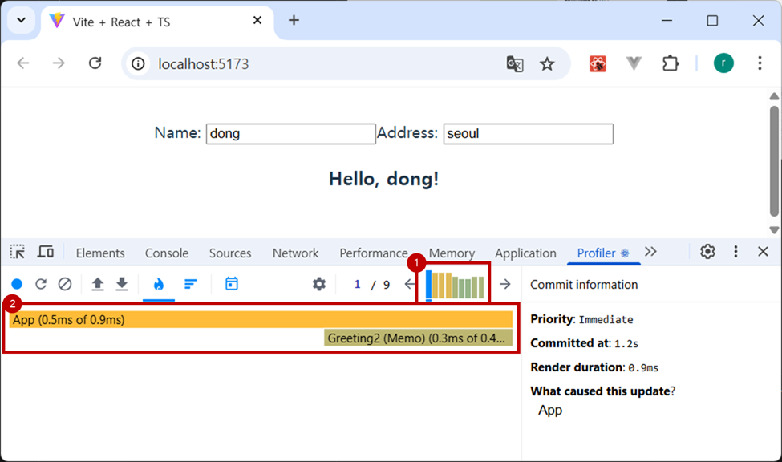
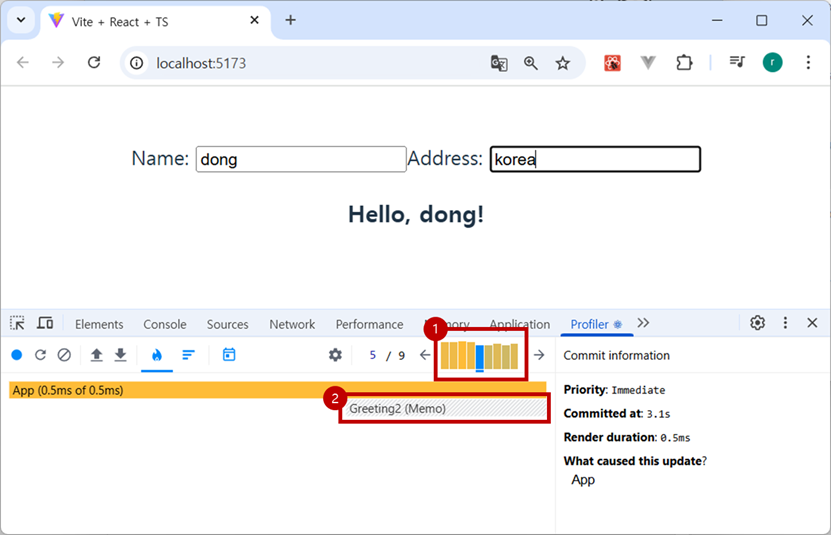
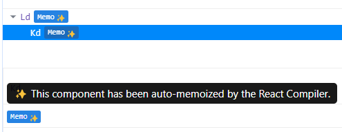

# ⚡️ 리액트 리렌더링 최적화 완전 정복

리액트 앱을 개발하다 보면, 성능 저하의 주요 원인 중 하나가 **불필요한 리렌더링**입니다. 이를 방지하고 성능을 최적화하기 위한 대표적인 도구들로 `memo`, `useCallback`, `useMemo`, `key`, 그리고 최신 기술인 `React Compiler`가 있습니다. 각각 어떤 역할을 하는지, 언제 사용하면 좋은지 정리해봤습니다.

---

## ✅ `memo`: 컴포넌트 메모이제이션

`memo`는 **props가 변경되지 않으면 컴포넌트를 리렌더링하지 않고 결과를 재사용**합니다.  
컴포넌트 단위에서 불필요한 리렌더링을 막는 가장 기본적인 방법이에요.

```tsx
const Greeting = memo(function Greeting({ name }: { name: string }) {
  console.log("Greeting was rendered at", new Date().toLocaleTimeString());
  return <h3>Hello{name && ', '}{name}!</h3>;
});
```

### 예시 코드
```tsx
function App() {
  const [name, setName] = useState('');
  const [address, setAddress] = useState('');

  return (
    <>
      <input value={name} onChange={e => setName(e.target.value)} />
      <input value={address} onChange={e => setAddress(e.target.value)} />
      <Greeting name={name} />
    </>
  );
}
```
- 첫 번째 커밋: App 전체 렌더링 시간 0.9ms (Greeting: 0.3ms)  

- 이후 커밋: Greeting은 렌더링 스킵 → 렌더링 시간 0.5ms로 단축


---

## 🔁 `useCallback`: 함수 메모이제이션

컴포넌트가 리렌더링될 때마다 **함수는 새로 생성**됩니다. 이로 인해 memoized 컴포넌트도 다시 렌더링될 수 있어요. `useCallback`은 **같은 함수 인스턴스를 유지**할 때 사용합니다.

```tsx
const onLogging = useCallback(() => {
  console.log(count);
}, [count]); // count가 바뀔 때만 새로 생성됨
```

### 예시
```tsx
const MyButton = memo(({ onClick }: { onClick: () => void }) => {
  console.log('button rendered');
  return <button onClick={onClick}>Logging</button>;
});
```

🔍 **핵심 포인트**
- `useCallback` 없으면 `onClick`이 매번 새로 생성되어 `MyButton` 리렌더링 발생
- 자식 컴포넌트에 함수를 넘길 땐 **`memo + useCallback` 조합**으로 최적화

---


## 🧠 `useMemo`: 값 계산 메모이제이션

`useMemo`는 **비용이 큰 계산 결과를 메모이제이션**합니다. 리렌더링 시 매번 계산하지 않고, 의존성 배열이 변할 때만 다시 계산해요.

```tsx
const visibleTodos = useMemo(() => filterTodos(todos, tab), [todos, tab]);
```

### 예시
```tsx
<TodoList todos={todos} tab={tab} theme="dark" />
```

- `theme`만 변경되었다면 `visibleTodos`는 이전 값을 그대로 재사용  
- `List` 컴포넌트는 memoized 상태 → 렌더링 스킵

---

## 🔑 `key`: 리스트 최적화를 위한 식별자

React의 diffing 알고리즘은 리스트의 변경을 효율적으로 감지하기 위해 `key`를 사용합니다.

```tsx
{items.map(item => (
  <li key={item.id}>{item.name}</li>
))}
```

❗️ `index`를 key로 사용하면 요소 순서 변경 시 불필요한 리렌더링이 발생할 수 있어요.  
항상 **고유한 ID나 값**을 사용하는 것이 좋습니다.

## 🧪 React Compiler: 자동 메모이제이션

React의 최신 컴파일러는 **개발자가 명시적으로 `memo`, `useCallback`, `useMemo`를 쓰지 않아도** 컴포넌트, 함수, 값 등을 자동으로 최적화합니다.

### 🔻 도입 전

```tsx
const onLogging = useCallback(() => {
  console.log(count);
}, [count]);
```


### 🔺 도입 후 (컴파일러 최적화 자동 적용)

```tsx
const onLogging = () => {
  console.log(count);
};
```



컴파일러가 자동으로 함수 인스턴스를 최적화하여, 리렌더링이 방지됩니다.

## 📌 정리표

| 최적화 도구      | 설명 |
|------------------|------|
| `memo`           | props가 변경되지 않으면 컴포넌트 리렌더링 방지 |
| `useCallback`    | 함수를 메모이제이션하여 자식 컴포넌트 리렌더링 방지 |
| `useMemo`        | 계산 비용이 큰 값을 메모이제이션하여 성능 향상 |
| `key`            | 리스트 렌더링에서 효율적인 변경 감지를 위한 고유 식별자 |
| `React Compiler` | 자동 메모이제이션을 통한 코드 최적화 |

---

💡 **Tip**  
최적화를 위해 모든 컴포넌트에 무조건 `memo`, `useCallback`을 쓰는 건 오히려 역효과일 수 있어요.  
**렌더링 비용이 높은 컴포넌트**, **props로 함수나 복잡한 객체를 받는 컴포넌트** 중심으로 선택적으로 적용하는 것이 핵심입니다.

---

